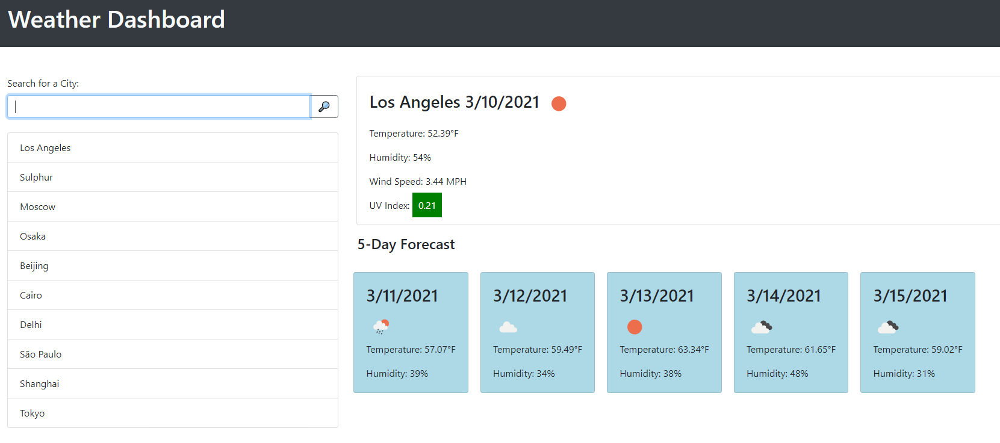

# Weather-Dashboard
Weather Dashboard using Open Weather Map API.

Application is deployed at this [link](https://matthewronaldjohnson.github.io/Weather-Dashboard/)

## Functionality 

This application takes in a user inputted city and displays current weather data and a five day forecast using data from the [OpenWeatherMap api](https://openweathermap.org). 

Under the input area a list of recent searches is displayed. If a user has no recent searches saved in local storage then a list of the 10 most populous cities in the world is displayed instead. This area is hidden on mobile view to keep content front and center. 
